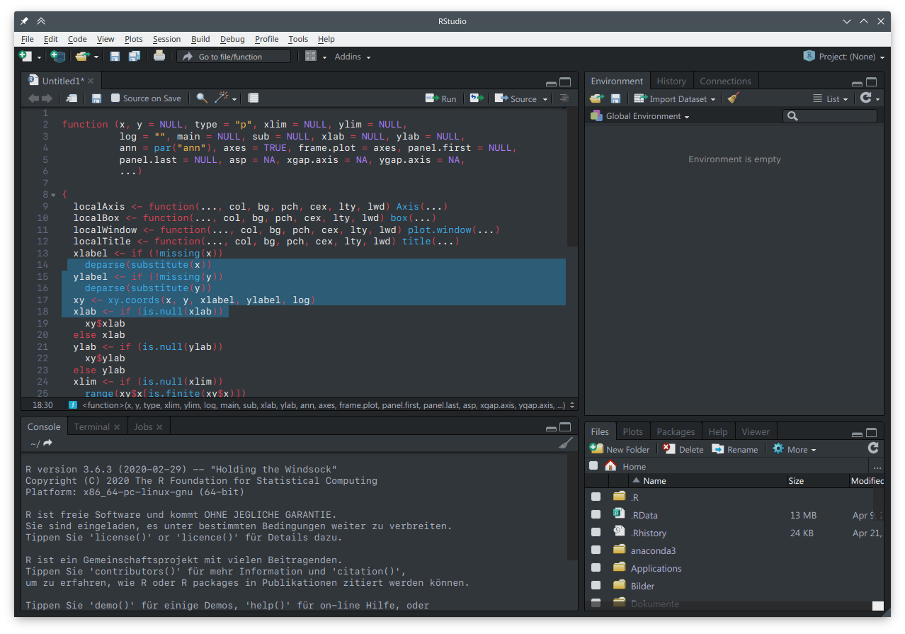

# BreezeDark-RStudio-Theme
This theme makes RStudio match the Breeze Dark theme in KDE Plasma.
Tested on KDE neon Testing Edition 5.18.4 and RStudio 1.2.1335.

**Instructions:** If you have RStudio ≥ 1.2, you can directly import the .rstheme file in the RStudio IDE. Then backup your original custom_styles.css stored in /usr/lib/rstudio/www and replace the original file with the one from this repository.
Finally, apply the theme via RStudio IDE.

