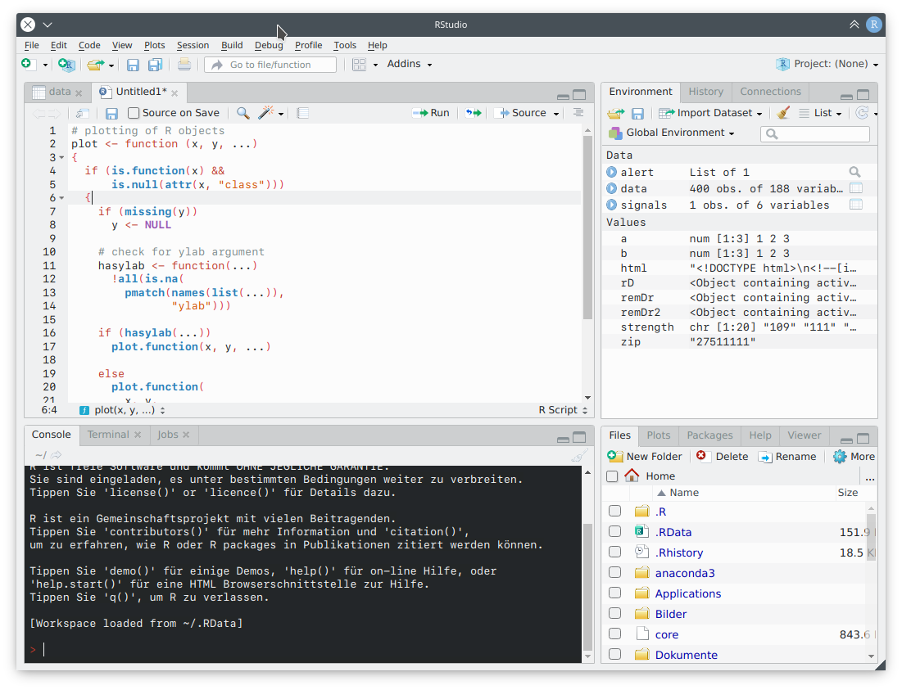

# Breeze-RStudio-Theme
These themes make RStudio match the Breeze Default and Breeze Dark theme in KDE Plasma.
Tested on KDE neon Testing Edition 5.18.5 and RStudio 1.2.1335.

**Instructions** If you have RStudio ≥ 1.2, you can directly import the .rstheme file in the RStudio IDE and apply the theme via RStudio IDE.

**To-Do** 
- [X] Get rid of custom_styles.css
- [X] upload Default Breeze theme
- [ ] Breeze-Default: consider changing the console background back to white
- [ ] Breeze-Default: replace scrollbars
- [ ] Replace icons with original Breeze icons 
- [ ] change / or match code-colors and font-weights of both themes

